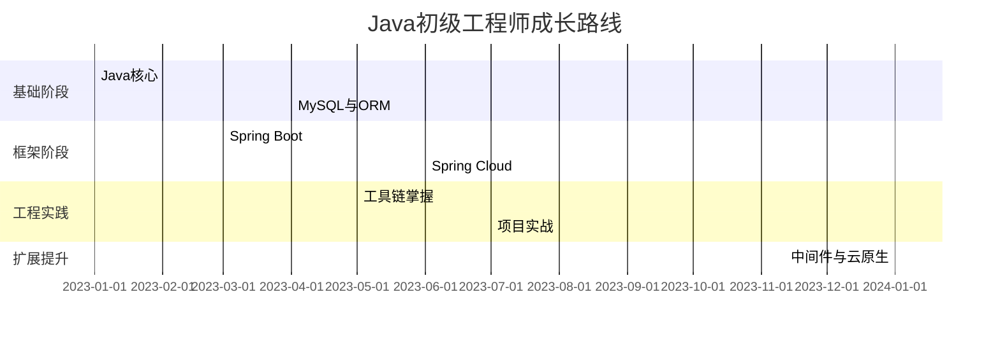

### **Java初级开发工程师全面成长路线**
**目标**：1年内掌握企业级开发全流程技术栈，达到可独立开发模块的水平

---

### **一、Java核心技术（1-3个月）**
#### **1. 语言基础**
- **核心语法**：数据类型、流程控制、异常处理
- **面向对象**：封装/继承/多态、接口/抽象类
- **新特性**：Lambda表达式、Stream API、Optional
- **学习资源**：《Java核心技术卷Ⅰ》 + [CodeGym实战平台](https://codegym.cc/)

#### **2. 高级特性**
- **集合框架**：ArrayList/HashMap底层原理、Fail-Fast机制
- **多线程**：线程池（ThreadPoolExecutor）、锁机制（ReentrantLock）
- **IO/NIO**：文件操作、网络通信模型
- **项目实战**：开发多线程下载器（支持断点续传）

---

### **二、数据库与ORM（2-4个月）**
#### **1. MySQL基础**
- **SQL进阶**：复杂查询（JOIN/子查询）、事务隔离级别
- **性能优化**：执行计划解读、索引设计原则
- **工具使用**：Navicat、MySQL Workbench

#### **2. ORM框架**
- **MyBatis**：动态SQL、二级缓存、插件开发
- **JPA**：实体关系映射、Spring Data JPA
- **项目实战**：电商系统商品模块（CRUD+分页查询）

---

### **三、Spring生态（3-6个月）**
#### **1. Spring Boot**
- **核心功能**：自动配置原理、Starter机制
- **Web开发**：RESTful API设计、参数校验
- **集成测试**：MockMVC、Testcontainers
- **项目实战**：博客系统API（文章/评论/分类管理）

#### **2. Spring Cloud Alibaba**
- **服务注册**：Nacos集群搭建
- **服务调用**：OpenFeign声明式调用
- **熔断限流**：Sentinel规则配置
- **项目实战**：微服务天气查询系统（对接第三方API）

---

### **四、前端基础（1-2个月）**
#### **1. 三件套**
- **HTML5**：语义化标签、表单验证
- **CSS3**：Flex布局、媒体查询
- **JavaScript**：ES6语法、DOM操作

#### **2. 前端框架**
- **Vue基础**：Vue CLI、组件通信
- **Ajax**：Axios封装、跨域处理
- **项目实战**：管理后台前端（配合Spring Boot API）

---

### **五、开发工具链（持续学习）**
| **工具类型**     | **必学工具**                  | **核心技能**                          |
|------------------|------------------------------|---------------------------------------|
| 版本控制         | Git                          | 分支管理、冲突解决、Rebase操作         |
| 构建工具         | Maven/Gradle                 | 多模块构建、依赖冲突解决               |
| 容器化           | Docker                       | Dockerfile编写、Compose部署           |
| 持续集成         | Jenkins                      | Pipeline脚本编写、自动化部署           |
| 开发环境         | IntelliJ IDEA                | 高效插件（Lombok、MyBatisX）          |
| Linux基础        | 常用命令                     | 日志分析、服务部署、Shell脚本编写      |

---

### **六、工程实践（6-12个月）**
#### **1. 代码质量**
- **单元测试**：JUnit 5参数化测试、Mockito模拟
- **代码规范**：阿里巴巴Java开发手册、Checkstyle
- **静态分析**：SonarQube漏洞检测

#### **2. 性能优化**
- **JVM调优**：GC日志分析、内存泄漏定位
- **SQL优化**：慢查询日志、索引失效场景
- **缓存设计**：Redis缓存穿透/雪崩解决方案

#### **3. 项目实战**
- **综合项目**：在线教育平台（含视频点播模块）
- **技术亮点**：
    - JWT权限认证
    - Elasticsearch课程搜索
    - 支付宝沙箱支付集成
    - 基于MinIO的文件存储

---

### **七、扩展技术栈（12+个月）**
#### **1. 中间件**
- **消息队列**：RocketMQ事务消息
- **分布式锁**：Redisson实现
- **配置中心**：Apollo动态配置

#### **2. 云原生**
- **Kubernetes**：Pod部署、Service暴露
- **Serverless**：函数计算开发
- **监控体系**：Prometheus + Grafana

#### **3. 架构基础**
- **DDD入门**：领域模型设计
- **CQRS模式**：读写分离实践
- **事件驱动**：Spring Cloud Stream

---

### **学习路径图**

---

### **关键建议**
1. **每日代码量**：保持200+行有效代码产出
2. **技术博客**：每月至少2篇技术文章（推荐[掘金](https://juejin.cn/)平台）
3. **开源参与**：从文档翻译开始参与Apache项目
4. **面试准备**：定期刷[牛客网](https://www.nowcoder.com/)真题
5. **技术社交**：加入本地技术社区（如Meetup）

---

**避坑提醒**：
- 不要过早追求"源码级理解"，先掌握使用再研究原理
- 避免重复造轮子，合理使用开源组件
- 警惕"技术松鼠症"，学完一个技术栈再开启下一个

按照此路线坚持学习+实践，1年后可达到：
- **技术能力**：可独立完成中小型系统模块开发
- **工程能力**：具备基础架构设计思维
- **薪资水平**：一线城市15-25K，二线城市8-15K